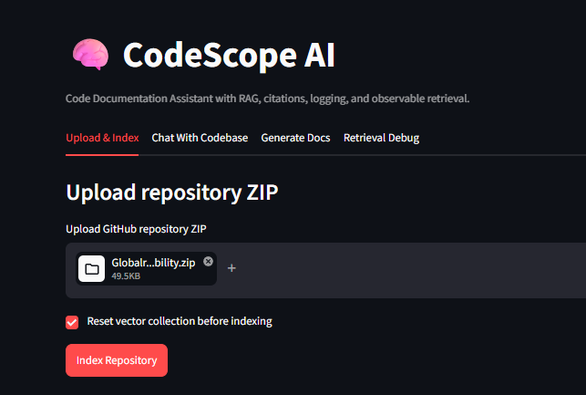
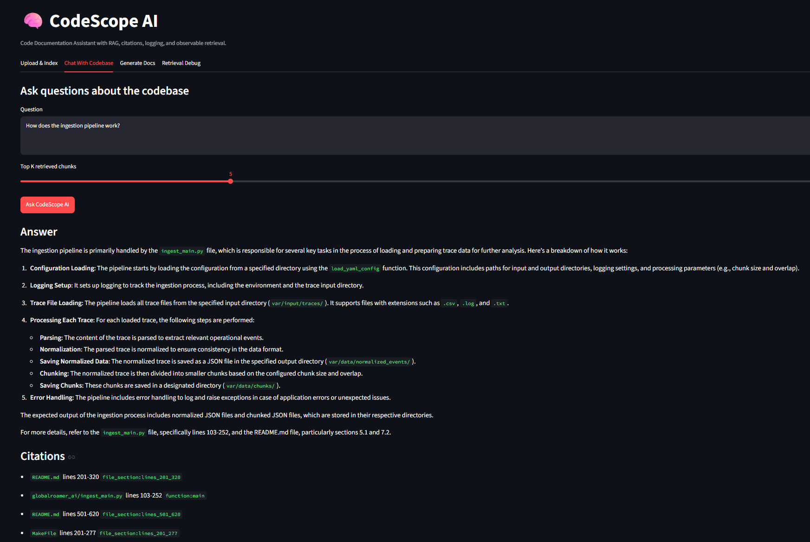
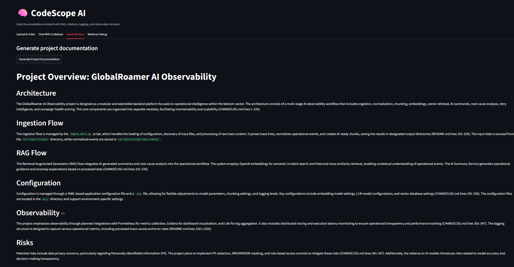
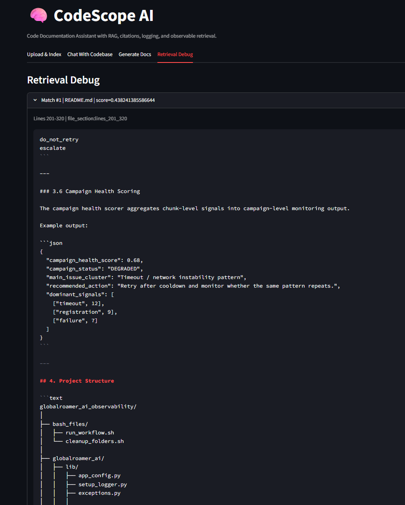
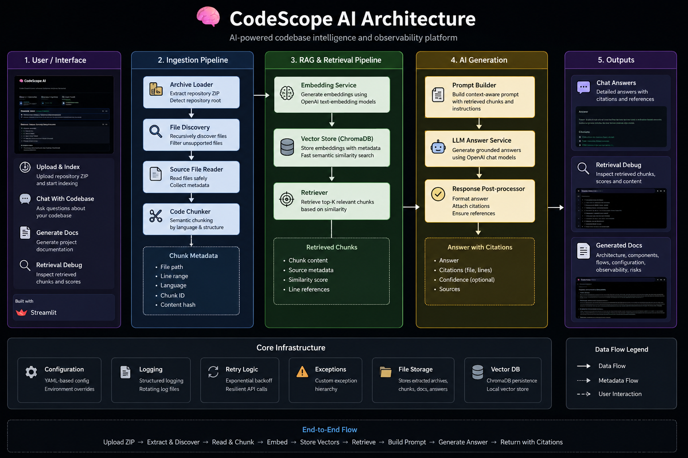

# 🧠 CodeScope AI

<div align="center">


</div>

---

<div align="center">

AI-powered engineering intelligence platform for semantic repository analysis, grounded codebase Q&A, retrieval debugging, and AI-generated technical documentation.

</div>

---

# 🚀 Demo

## Upload & Repository Indexing



---

## AI Codebase Chat



---

## AI Documentation Generation



---

## Retrieval Debugging & Explainability



---

## ✨ Core Features

- Semantic repository indexing
- AST-aware Python code chunking
- Retrieval-Augmented Generation (RAG)
- Grounded codebase Q&A
- AI-generated technical documentation
- Retrieval debugging visibility
- ChromaDB vector retrieval
- OpenAI embeddings + LLM integration
- Production-oriented project structure
- Observability-first engineering design

---

## 🧭 High-Level Architecture



---

## 📂 Project Structure

```text
CodeScope-AI/
│
├── codescope_ai/
│   ├── app/
│   │   ├── core/
│   │   │   ├── app_config.py
│   │   │   ├── exceptions.py
│   │   │   ├── retry.py
│   │   │   └── setup_logger.py
│   │   │
│   │   ├── ingestion/
│   │   │   ├── archive_loader.py
│   │   │   ├── file_discovery.py
│   │   │   ├── source_file_reader.py
│   │   │   └── code_chunker.py
│   │   │
│   │   ├── rag/
│   │   │   ├── embedding_client.py
│   │   │   ├── vector_store.py
│   │   │   ├── retriever.py
│   │   │   ├── prompt_builder.py
│   │   │   ├── llm_client.py
│   │   │   └── answer_service.py
│   │   │
│   │   ├── documentation/
│   │   │   ├── file_documenter.py
│   │   │   └── project_documenter.py
│   │   │
│   │   └── ui/
│   │       └── streamlit_app.py
│   │
│   └── main.py
│
├── etc/
│   └── codescope_ai_config.yml
│
├── var/
│   ├── input_data/
│   ├── extracted_archives/
│   ├── vector_db/
│   ├── generated_docs/
│   ├── generated_answers/
│   └── log/
│
├── tests/
├── Dockerfile
├── requirements.txt
├── pyproject.toml
├── Makefile
├── README.md
├── DECISIONS.md
└── .env.example
```

---

## 🛠️ Tech Stack

| Layer | Technology |
|---|---|
| Frontend | Streamlit |
| Backend | Python 3.11 |
| Vector Database | ChromaDB |
| Embeddings | OpenAI text-embedding-3-small |
| LLM | GPT-4o-mini |
| Testing | Pytest |
| Containerization | Docker |
| Configuration | YAML + .env |
| Logging | Python logging |

---

## ⚖️ Engineering Tradeoffs

| Decision | Tradeoff |
|---|---|
| Streamlit | Fast development vs frontend flexibility |
| ChromaDB | Easy local setup vs distributed scalability |
| OpenAI APIs | High quality vs vendor dependency |
| AST chunking | Better retrieval vs parsing complexity |
| Local-first design | Simpler onboarding vs cloud scalability |

---

## 📈 Current Metrics

| Metric | Result |
|---|---|
| Test Coverage Scope | 18 pytest tests |
| Indexed Repository Example | 32 files |
| Semantic Chunks Generated | 134 |
| Embedding Backend | OpenAI |
| Retrieval Backend | ChromaDB |
| Runtime Platform | Windows/Linux/macOS |

---

## ✅ Validation

```text
18 pytest tests passing
134 semantic chunks indexed
Cross-platform execution validated on Windows
```

---

## 🎯 Engineering Motivation

Most AI coding assistants operate as black boxes.

This project explores how semantic retrieval,
grounded generation,
retrieval observability,
and engineering-focused AI workflows
can be combined into a more transparent and trustworthy developer platform.

---

# ⚡ Quick Start

## Clone Repository

```bash
git clone https://github.com/w-e-ll/CodeScope-AI.git
cd CodeScope-AI
```

# Create Virtual Environment

## Linux/macOS

```bash
python3 -m venv .venv
source .venv/bin/activate
```

## Windows

```powershell
python -m venv .venv
.venv\Scripts\activate
```
## Install Dependencies

```bash
pip install -r requirements.txt
```

## Configure Environment

```bash
cp .env.example .env
```

```env
OPENAI_API_KEY=your_api_key
```

## Run Application

```bash
streamlit run codescope_ai/app/ui/streamlit_app.py
```

---

# 📚 Overview

CodeScope AI analyzes software repositories and allows engineers to:

- upload repository archives
- semantically analyze source code
- generate vector embeddings
- retrieve relevant engineering context
- ask grounded natural language questions
- generate technical documentation
- inspect retrieval/debug visibility
- understand architecture and operational flows.

The project focuses heavily on:

- maintainability
- observability
- scalability
- operational transparency
- semantic retrieval quality
- production-oriented AI workflows.

---

## 🧠 Why This Project Exists

Modern repositories grow faster than engineers can understand them.

CodeScope AI was designed to reduce onboarding time,
improve repository discoverability,
and provide grounded AI-assisted engineering workflows.

Instead of acting like a generic chatbot,
the platform focuses on:

- repository intelligence
- semantic code understanding
- retrieval explainability
- operational observability
- grounded technical answers.

---

## 🧠 Semantic Code Understanding

The system understands:

- Python classes
- functions
- async functions
- decorators
- imports
- repository structure
- configuration files
- Docker files
- Markdown documentation

---

## 🔎 AI Codebase Chat

Example questions:

```text
Where is logging configured?
How does retry logic work?
Which files implement vector retrieval?
What is the ingestion flow?
How are embeddings generated?
Which services interact with ChromaDB?
How is exception handling implemented?
```

---

## 📄 AI Documentation Generation

Generate:

- project-level documentation
- file-level technical summaries
- architecture explanations
- ingestion flow explanations
- RAG flow explanations

---

## 🧩 Retrieval Debug Visibility

The UI exposes:

- retrieved chunks
- similarity scores
- source files
- line ranges
- retrieved symbols

This greatly improves:

- explainability
- trustworthiness
- observability
- debugging

---

## 🧠 Supported File Types

The platform currently supports:

```text
.py
.md
.txt
.yml
.yaml
.toml
.json
.sql
.ini
.cfg
Dockerfile
Makefile
requirements.txt
README.md
```

---

## 🔎 Example Questions

```text
Where is logging configured?

How does retry logic work?

Which files implement vector retrieval?

How are embeddings generated?

What would be required to productionize this application?

How does the ingestion pipeline work?

Which files handle exceptions?
```

---

## 📈 Future Improvements

- Hybrid retrieval (BM25 + vectors)
- Reranking models
- Repository graph retrieval
- Async indexing
- Background workers
- GitHub integration
- OpenTelemetry tracing
- Evaluation framework
- Authentication / RBAC
- Incremental repository sync

---

## 🔐 Security Considerations

Future production improvements:

- ZIP malware scanning
- Prompt injection protection
- Repository isolation
- Secret scanning
- Upload quotas
- RBAC / OAuth2
- PII filtering

---

## 🧪 Testing

The project includes pytest-based coverage for:

- configuration loading
- retry logic
- archive extraction
- repository discovery
- source reading
- semantic chunking
- vector storage
- prompt generation
- answer generation.

### Run tests:

```bash
pytest tests -v
```
---

## 🐳 Docker

### Build

```bash
docker build -t codescope-ai .
```

### Run

```bash
docker run -p 8501:8501 \
-e OPENAI_API_KEY=your_api_key \
codescope-ai
```

---

## 📌 Final Vision

The long-term vision is to evolve CodeScope AI into an engineering intelligence platform capable of:

- understanding large codebases
- accelerating onboarding
- generating technical documentation
- improving debugging workflows
- increasing repository observability
- supporting engineering teams with grounded AI workflows.

Core engineering idea:

```text
AI becomes significantly more useful when integrated into operational engineering workflows instead of acting as an isolated chatbot.
```
